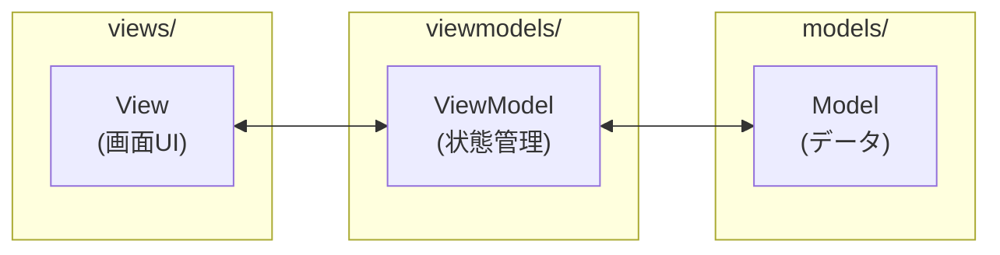
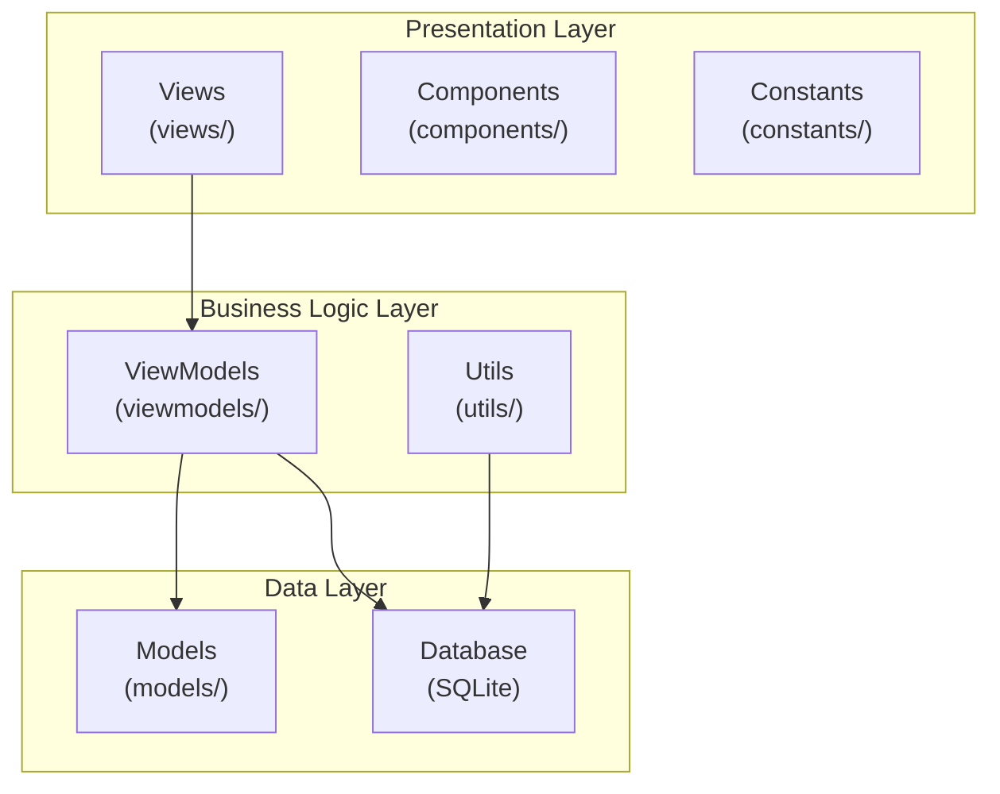
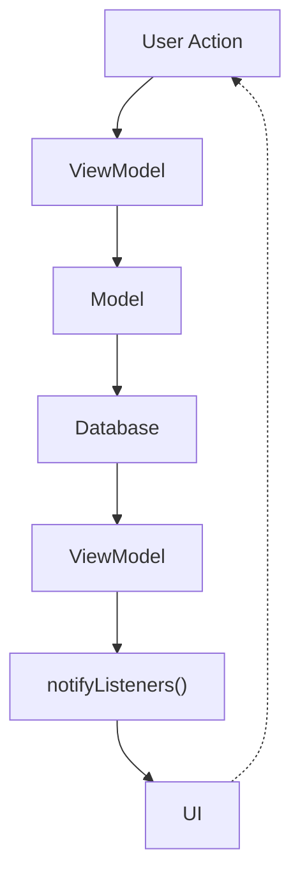

# 🏗 アーキテクチャ

このドキュメントでは、日本株ひとこと投資メモアプリの技術仕様と設計について詳しく説明します。

## 📂 プロジェクト構成

```
jpstockminimemo/
├── lib/
│   ├── components/          # 再利用可能なUIコンポーネント
│   │   ├── adbanner.dart           # 広告バナーコンポーネント
│   │   ├── custom_alert_dialog.dart # カスタムダイアログ
│   │   ├── custom_text_form_field.dart # カスタム入力フィールド
│   │   └── stock_card.dart         # 株式情報表示カード
│   ├── constants/           # 定数定義
│   │   ├── box_styles.dart         # ボックススタイル定義
│   │   ├── colors.dart             # カラーパレット
│   │   ├── imports.dart            # 共通インポート
│   │   ├── text_styles.dart        # テキストスタイル定義
│   │   └── texts.dart              # テキスト定数
│   ├── models/              # データモデル
│   │   └── stock_memo.dart         # 株式メモのデータモデル
│   ├── utils/               # ユーティリティ関数
│   │   ├── dbhelper.dart           # データベースヘルパー
│   │   └── stock_code_validator.dart # 証券コードバリデーター
│   ├── viewmodels/          # ビューモデル（Provider）
│   │   ├── edit_model.dart         # 編集画面の状態管理
│   │   ├── list_model.dart         # 一覧画面の状態管理
│   │   └── settings_model.dart     # 設定画面の状態管理
│   ├── views/               # 画面（View）
│   │   ├── edit_page.dart          # 編集・新規作成画面
│   │   ├── error_page.dart         # エラー画面
│   │   ├── list_page.dart          # メモ一覧画面
│   │   ├── load_page.dart          # ローディング画面
│   │   └── settings_page.dart      # 設定画面
│   └── main.dart            # アプリケーションエントリーポイント
├── assets/                  # アセットファイル
│   └── icons/               # アプリアイコン
├── android/                 # Android固有設定
├── ios/                     # iOS固有設定
├── test/                    # テストファイル
└── docs/                    # ドキュメント
```

## 🏛 アーキテクチャパターン

### MVVM（Model-View-ViewModel）パターン

このアプリでは、MVVM パターンを採用して関心の分離を実現しています。



#### View（画面 UI）

- `views/` ディレクトリの各画面
- UI の表示とユーザーインタラクションを担当
- ViewModel の状態を監視して UI を更新

#### ViewModel（状態管理）

- `viewmodels/` ディレクトリの各モデル
- Provider パッケージを使用した状態管理
- View と Model の仲介役

#### Model（データ）

- `models/` ディレクトリのデータモデル
- データ構造の定義
- ビジネスロジックは含まない

## 🗂 レイヤー構成



### 1. Presentation Layer（プレゼンテーション層）

- **Views**: 画面 UI（`views/`）
- **Components**: 再利用可能な UI コンポーネント（`components/`）
- **Constants**: UI 関連の定数（`constants/`）

### 2. Business Logic Layer（ビジネスロジック層）

- **ViewModels**: 状態管理とビジネスロジック（`viewmodels/`）
- **Utils**: ユーティリティ関数（`utils/`）

### 3. Data Layer（データ層）

- **Models**: データモデル（`models/`）
- **Database**: SQLite データベース（`utils/dbhelper.dart`）

## 🔄 状態管理

### Provider パターン

```dart
// ViewModel の例
class ListModel extends ChangeNotifier {
  List<StockMemo> _memos = [];

  List<StockMemo> get memos => _memos;

  void addMemo(StockMemo memo) {
    _memos.add(memo);
    notifyListeners(); // UIに変更を通知
  }
}

// View での使用例
Consumer<ListModel>(
  builder: (context, model, child) {
    return ListView.builder(
      itemCount: model.memos.length,
      itemBuilder: (context, index) {
        return StockCard(memo: model.memos[index]);
      },
    );
  },
)
```

### 状態の流れ



## 🗄 データベース設計

### SQLite テーブル構造

```sql
CREATE TABLE stock_memos (
  id INTEGER PRIMARY KEY AUTOINCREMENT,
  stock_code TEXT NOT NULL,
  stock_name TEXT NOT NULL,
  memo TEXT NOT NULL,
  created_at DATETIME DEFAULT CURRENT_TIMESTAMP,
  updated_at DATETIME DEFAULT CURRENT_TIMESTAMP
);
```

### データモデル

```dart
class StockMemo {
  final int? id;
  final String stockCode;
  final String stockName;
  final String memo;
  final DateTime? createdAt;
  final DateTime? updatedAt;

  // コンストラクタ、fromMap、toMap メソッド
}
```

## 🎨 UI/UX 設計

### デザインシステム

#### カラーパレット（`constants/colors.dart`）

```dart
class AppColors {
  static const Color primary = Color(0xFF2196F3);
  static const Color accent = Color(0xFF03DAC6);
  static const Color background = Color(0xFFFFFFFF);
  // その他の色定義
}
```

#### テキストスタイル（`constants/text_styles.dart`）

```dart
class AppTextStyles {
  static const TextStyle headline1 = TextStyle(
    fontSize: 24,
    fontWeight: FontWeight.bold,
  );
  // その他のスタイル定義
}
```

### コンポーネント設計

#### 再利用可能なコンポーネント

- `StockCard`: 株式メモ表示カード
- `CustomTextFormField`: カスタム入力フィールド
- `CustomAlertDialog`: カスタムダイアログ
- `AdBanner`: 広告バナー

## 🔧 技術的な実装詳細

### 証券コードバリデーション

```dart
class StockCodeValidator {
  static bool isValid(String code) {
    // 4桁数字パターン: 1234
    final numericPattern = RegExp(r'^\d{4}$');

    // 英文字組入れパターン: 1234A
    final alphaNumericPattern = RegExp(r'^\d{4}[A-Z]$');

    return numericPattern.hasMatch(code) ||
           alphaNumericPattern.hasMatch(code);
  }
}
```

### 国際化対応

```dart
// 日本語リソースの設定
MaterialApp(
  localizationsDelegates: [
    GlobalMaterialLocalizations.delegate,
    GlobalWidgetsLocalizations.delegate,
    GlobalCupertinoLocalizations.delegate,
  ],
  supportedLocales: [
    Locale('ja', ''), // 日本語
  ],
)
```

### 広告統合

```dart
// Google Mobile Ads の実装
class AdBanner extends StatefulWidget {
  @override
  _AdBannerState createState() => _AdBannerState();
}

class _AdBannerState extends State<AdBanner> {
  BannerAd? _bannerAd;

  @override
  void initState() {
    super.initState();
    _createBannerAd();
  }

  void _createBannerAd() {
    _bannerAd = BannerAd(
      size: AdSize.banner,
      adUnitId: Platform.isAndroid
        ? androidAdUnitId
        : iosAdUnitId,
      request: AdRequest(),
      listener: BannerAdListener(),
    )..load();
  }
}
```

## 🔒 セキュリティ

### データ保護

- ローカル SQLite データベースを使用
- 外部サーバーとの通信なし
- ユーザーデータは端末内に保存

### コード難読化

```bash
# リリースビルド時の難読化
flutter build apk --obfuscate --split-debug-info=build/app/outputs/symbols
```

## 📈 パフォーマンス最適化

### メモリ管理

- `ListView.builder` を使用した効率的なリスト表示
- 不要なウィジェットのリビルドを避ける
- `const` コンストラクタの積極的な使用

### バンドルサイズの最適化

- 不要な依存関係の除去
- プラットフォーム固有のビルド最適化

## 🧪 テスト戦略

### 単体テスト

- ビジネスロジックのテスト
- バリデーション関数のテスト
- データモデルのテスト

### ウィジェットテスト

- UI コンポーネントのテスト
- ユーザーインタラクションのテスト

### 統合テスト

- アプリ全体の動作テスト
- データベース操作のテスト
